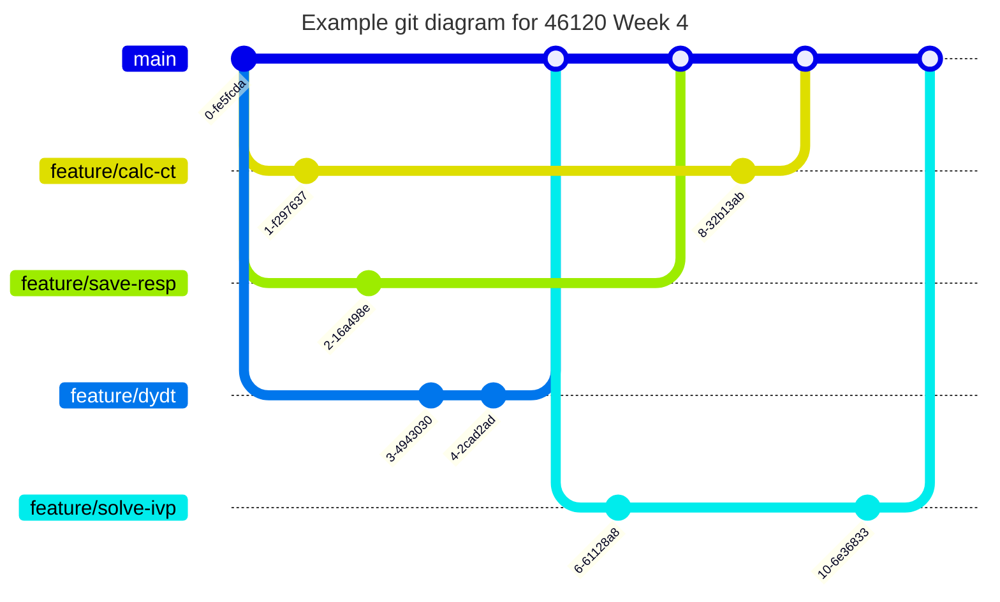

# PiWE Week 4: Turbie Part 2

Welcome to Turbie Part 2: Windy Boogaloo!

Slides from lecture:  
 * In this subfolder.

## Overall objectives

1. Load a look-up-table from file and use it to calculate Ct, given a wind time series.  
1. Create a function that evaluates $\frac{dy}{dt}=f(t,y)$ for both homogeneous and forced response. 
1. Use `scipy.integrate.solve_ivp` to generate Turbie's time-marching response.
1. Save a response time series to file.

## Homework due next week

Parts 1 & 2 should be done by everyone individually.
Sub-parts in Part 3 should be parallelized.
NB: Part 3C cannot be completed before Part 3B is merged.

If time permits, we highly recommend beginning planning for the final CodeCamp code (see [Recommended Extra Credit](#recommended-extra-credit)).

### Part 1: As a team, in class

Read through this page and make a plan of attack for who does which parts.

### Part 2: Individually

Understand the problem formulation

1. (Re)read the [Definition](hhttps://python-at-risoe.pages.windenergy.dtu.dk/codecamp/turbie/1-definition.html) page in Week 3 folder.
1. Read the Homogeneous response PDF in this folder, ignoring exercise.
1. Read the Forced response PDF in this folder, ignoring exercise.
1. Understand the state-space equation of the dynamic system, and note that the mass, damping and stiffness matrices (`M`, `C`, and `K`) are given by the function `get_turbie_system_matrices()` in Week 2 homework.

### Part 3: Individually and/or with your team

Distribute tasks in this part per in-class discussion (Part 1).
Development is complete when feature branches are merged such that all week4 tests on `main` pass and `code_week4.py` demonstrates functions as specified below.

Parts 3B and 3C are the heaviest tasks.
Part 3C cannot be finished until Part 3B is merged.

Add your code to existing files in repo as specified in instructions.
You should not need to create any new files.

#### Part A: Caculate Ct

1. Check out into feature branch `feature/calc-ct`.  
1. Run the Week 4 tests using `pytest`. Everything should fail.  
1. Examine the Ct file  `CT.txt`, which is in the `data/` folder
   in your team repo.
1. Make a function in `codecamp/__init__.py` called
   `calculate_ct(u_wind, path_ct)`:  
    * `u_wind` is a numpy array of wind time series, `path_ct` is a
      string or `pathlib.Path` object.  
    * The function calculates the mean of `u`, then interpolates
      the Ct curve from `mean(u)` and returns a float `ct`.  
    * The interpolation can be done by using `numpy.interp`. Consult the 
      [documentation](https://numpy.org/doc/stable/reference/generated/numpy.interp.html) 
      to learn its usage.   
1. Add code to `code_week4.py` that calls `calculate_ct()` for the wind
   speeds stored in `wind_12_ms_TI_0.1.txt`. (Hint: you might need to call
   `load_wind()` before you call `calculate_ct()`.)  
1. Re-run this week's tests. Does anything pass now?  
1. Add black-box diagram of function to repo.  
1. Open/review/merge PR.  

#### Part B: Write a dydt function for homogenous and forced responses

Function called `calculate_dydt` of form `dydt = f(t, y, ...)`, which calculates dy/dt for Turbie dynamical system.
It should calculate homogenous or forced response depending on inputs.

1. Check out into feature branch `feature/dydt`.  
1. Run the Week 4 tests using `pytest` and see what is failing.  
1. Recall the state-space equations for the homogenous and forced response, as you have gone through in Part 1.
1. Make a function called `calculate_dydt` in `codecamp/__init__.py` that
   calculate the RHS (right hand side) of the equation:
   * The required arguments shall be: 
      * `t`: time (float/int)
      * `y`: state vector (1D numpy array or list).
      * `M`: mass matrix (2D numpy array)  
      * `C`: damping matrix (2D numpy array)  
      * `K`: stiffness matrix  (2D numpy array)  
   * The keyword arguments shall be:  
      * `rho`: airdensity [kg/m3], default value: None (float/int)
      * `ct`: thrust coefficient [-], default value: None (float/int)
      * `rotor_area`: rotor area [m2], default value: None (float/int)
      * `t_wind`: time for the wind speed time series [s], default value: None (1D numpy array)
      * `u_wind`: stream wise wind speed for the wind speed time series  [m/s], default value: None (1D numpy array)  
   * It shall return:  
      * A 1D (!!!) numpy array of shape (4,). If your function returns an array of shape (4, 1), your output will be wrong size due to something called "broadcasting".    
   * When `u_wind` takes the default `None` value, calculate the homogenous response (i.e., forcing is zero).
   * When `u_wind` is not `None`, assume other required inputs (`rho`, `rotor_area`, `Ct`, `t_wind`) are also provided and calculate the forced response.
   * NOTES:  
      * Matrix multipication in the state-space equations should be matrix product (`numpy.matmul` with `@` operator as a shorthand).
      * Note that the specific wind speed at time `t` needs to be computed by interpolation using the given wind speed time series, defined by `t_wind` and `u_wind`.  
5. Add code to `code_week4.py` that calls `calculate_dydt()`
   function for both the homogenous response case and the forced response case.  
    * Use `t = 1` and `y = [1, 2, 3, 4]`.  
1. Re-run this week's tests. Do any more tests pass?  
1. Add black-box diagram of function to repo.  
1. Open/review/merge PR.  

#### Part C: Simulate homogenous and foced responses by solving an IVP

1. Check out into feature branch `feature/solve-ivp`.  
1. Run the Week 4 tests using `pytest` and see what is failing.  
1. Read the [documentation](https://docs.scipy.org/doc/scipy/reference/generated/scipy.integrate.solve_ivp.html) and go through the examples for `scipy.integrate.solve_ivp`.
   * Use also example of `fsolve` from class as reference.  
1. In `codecamp/__init__.py`, make a function called `simulate_turbie()` that:  
   * Takes as input:
      * `path_wind`: the path to the wind data file and is a string or a 
        `pathlib.Path` object. 
      * `path_parameters`: the path to the turbine parameters file and is a 
        string or a `pathlib.Path` object. 
      * `path_Ct`: the path to the turbine parameters file and is a 
        string or a `pathlib.Path` object.  
   * The function should return:
      * `t`: time of the simulated response [s], same as in the wind speed
         time series.
      * `u_wind`: stream wise wind speed [m/s].
      * `x_b`: displacment of the blade [m].
      * `x_t`: displacment of the tower [m].
   * Pass `calculate_dydt` into `scipy.integrate.solve_ivp` to solve the
     time-marching solution. Assume initial condition `(0, 0, 0, 0).`  
1. Update `code_week4.py` so it calls `simulate_turbie()` on
   `wind_12_ms_TI_0.1.txt`.  
1. Re-run this week's tests. Do any more tests pass?  
1. Add black-box diagram of function to repo.  
1. Open/review/merge PR.  

#### Part D: Save response to file

1. Check out into feature branch `feature/save-resp`.  
1. Run the Week 4 tests using `pytest` and see what is failing.  
1. In `codecamp/__init__.py`, make a function called `save_resp` that:  
    * Takes as inputs `t`, `u`, `xb` and `xt` (each 1D numpy arrays)
      and `path_save` (string/pathlib.Path).  
    * Saves the simulation results to txt file.
   * `numpy.savetxt` can be used with `delimiter='\t'` and 
     `fmt='%.3f'` to get a nice file. You should also pass in a header string 
      that explains the columns.
1. Add code to `code_week4.py` that saves your simulated results to a
file in a new subfolder called `resp/` with a filename `test_resp.txt`.   
    * Side quest: If you call `git status`, does it "see" the file? 
    Why/why not? (Hint: look at the `.gitignore`.)
    If you want the file to be added to your repo, check out the
    "force" option for `git add`.  
1. Compare the file you just simulated to `resp_12_ms_TI_0.1.txt`. Do they
   match?  
1. Re-run this week's tests. Do any more tests pass?  
1. Add black-box diagram of function to repo.  
1. Open/review/merge PR.  

## Recommended extra credit

Plan attack for codecamp submission.

1. Read the project description and rubric for CodeCamp in Week 6 subfolder.  
1. Design with your team an outline for the code you want to write.  
    * E.g., make a sketch, a list of steps, description of new functions and in which files they will be placed, etc.  
    * Be sure to consider the project constraints!  
1. Make plan for first feature branches.
1. If time, begin work on first feature branches.

## Other extra credit

If you want to know more behind the methods, if you have problems understand
the previous parts, or if you can find time, please go through the relevant
parts of the Day 3 lectures (there are different chapters you can navigate):
* [CodeCamp Aug 2022 Day 3 (Part A)](https://panopto.dtu.dk/Panopto/Pages/Viewer.aspx?id=8f0f69e4-c584-4314-a4e3-b10f00e67a1e) 
* [CodeCamp Aug 2022 Day 3 (Part B)](https://panopto.dtu.dk/Panopto/Pages/Viewer.aspx?id=4af05508-7fb4-49bd-b4f8-b10f00e67a19)
* [CodeCamp Aug 2022 Day 3 (Part C)](https://panopto.dtu.dk/Panopto/Pages/Viewer.aspx?id=84b1aa75-f9ec-4d05-aeb7-b10f00e67a1e)
   

## Additional material

1. McConnell, Steve. "[Why you should use routines... routinely.](https://gitlab.windenergy.dtu.dk/spp/spp-course-material/-/blob/main/week3_turbie_part2/%5BJ%5D%201998%20Why%20you%20should%20use%20routines...%20routinely.pdf?ref_type=heads)" IEEE Software 15.4 (1998): 96-95.  
    * In this subfolder!  
1. Tobin A. Driscoll and Richard J. Braun. "[Basics of IVPs](https://fncbook.github.io/fnc/ivp/basics.html)" in: *Fundamentals of Numerical Computation*. 

